# Team 3 Hackathon: Analysis Outputs in Graphs

This document visualizes the latest outputs from:

- `uv run src/entity_view_analysis.py`
- `uv run src/relationship_view_analysis.py`
- `uv run src/engagement_view_analysis.py`

Data snapshot source: console output shared on May 13, 2026.

## 1) Entity View

### Client Status Distribution

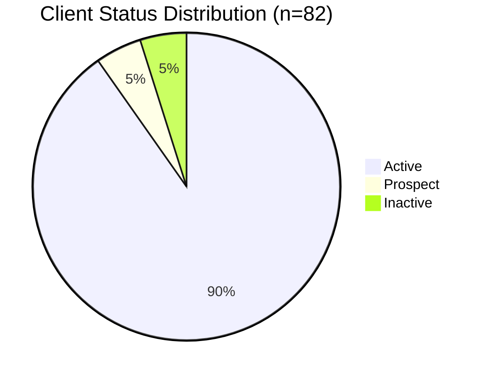

### Industry Distribution (Level 2)

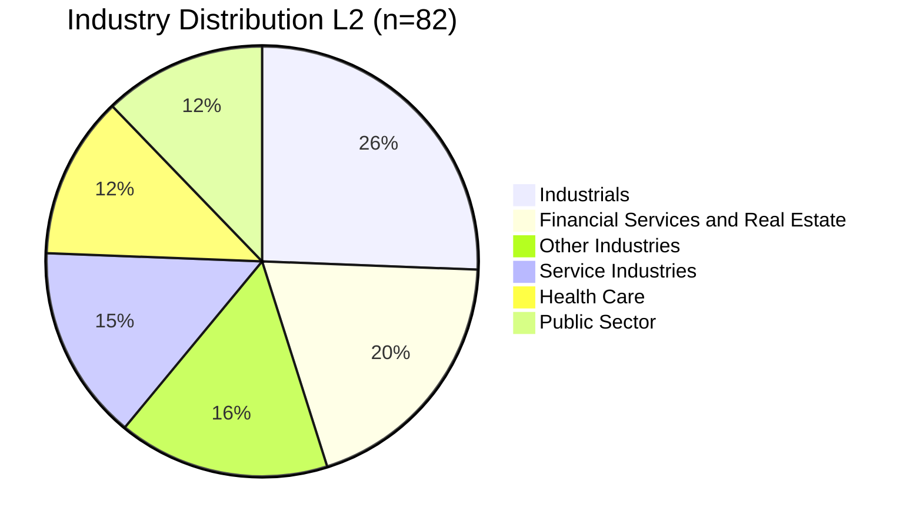

### Top Industry Distribution (Level 3)

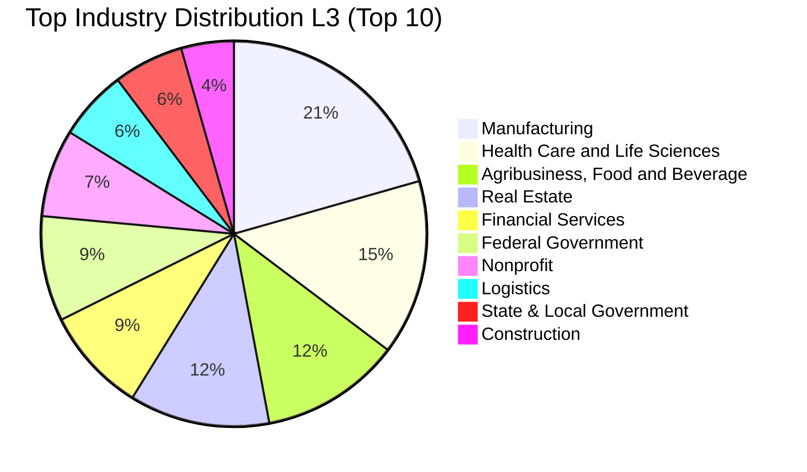

### Geography Distribution (Country)

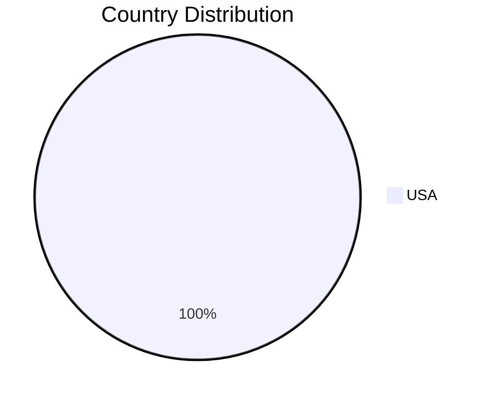

### Top States (Top 10)

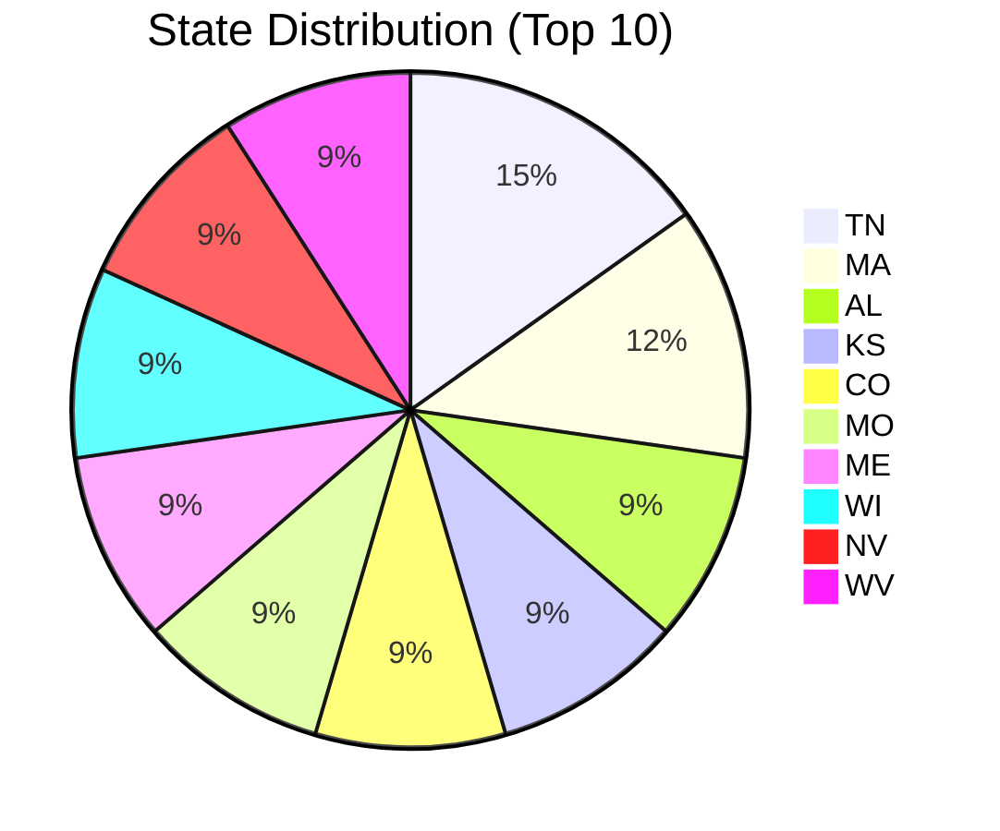

## 2) Relationship View

### Relationship Type Distribution

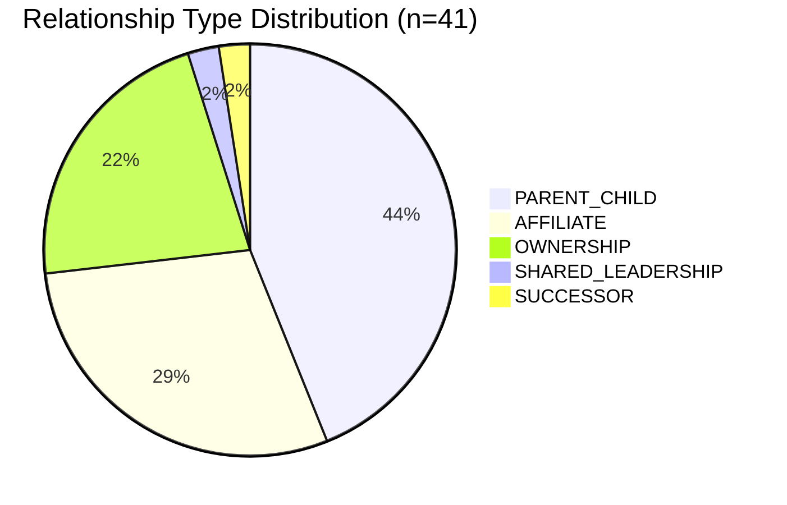

### Parent Entities by Number of Children (Top)

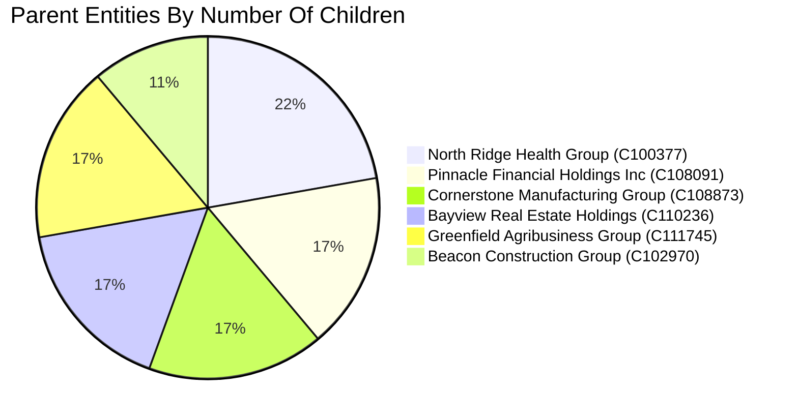

### Owners by Number of Ownership Links

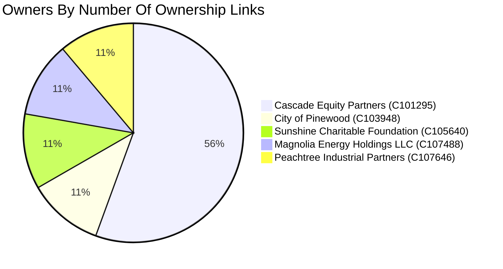

### Example Relationship Network (First 10 Rows)

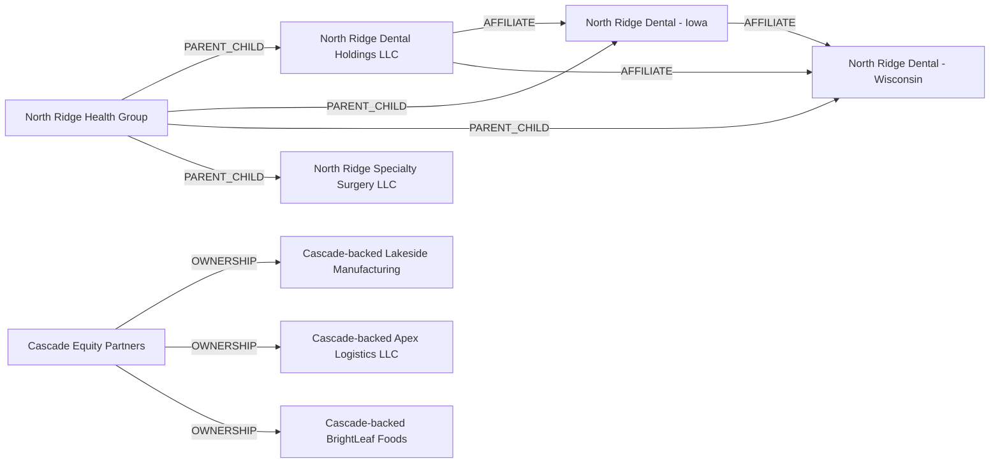

## 3) Engagement View

### Service Line L2 Usage

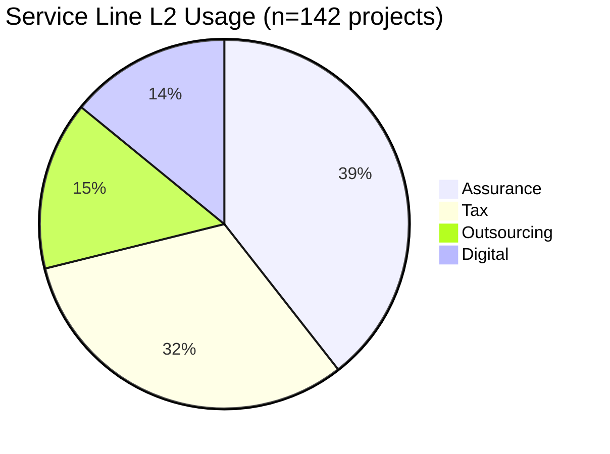

### Top Service Line L3 Usage (Top 10)

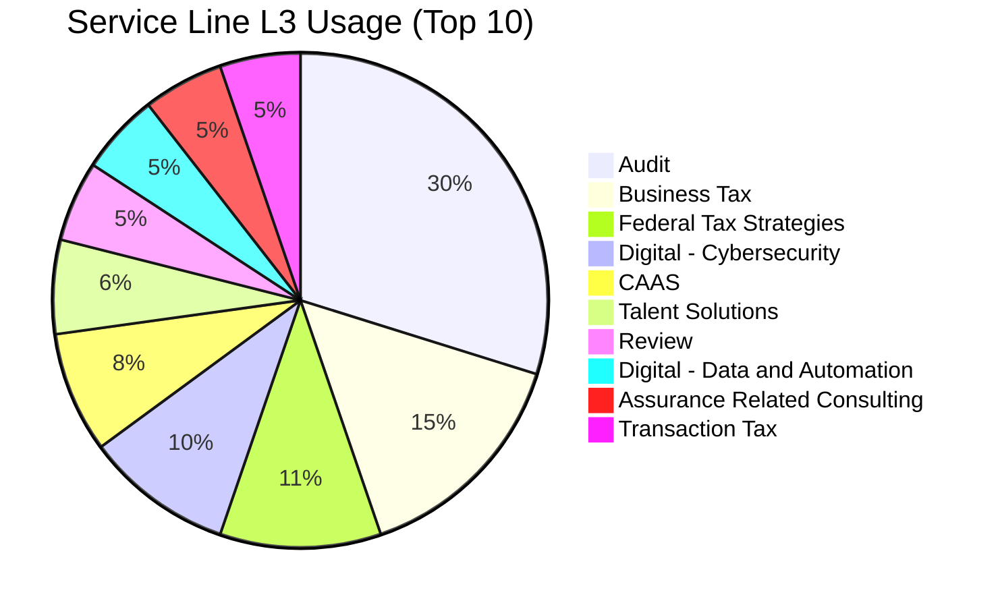

### Project Status Distribution

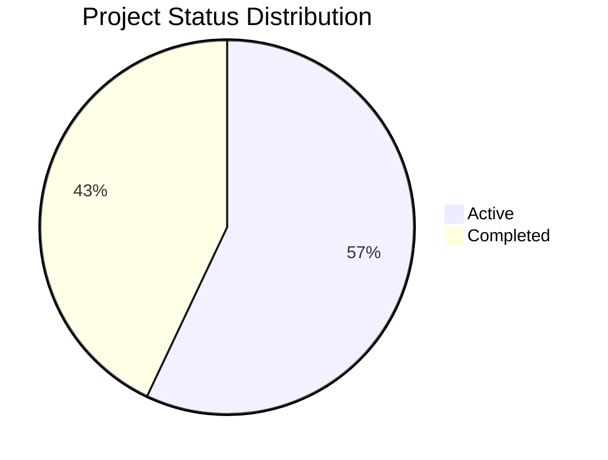

### Billable Distribution

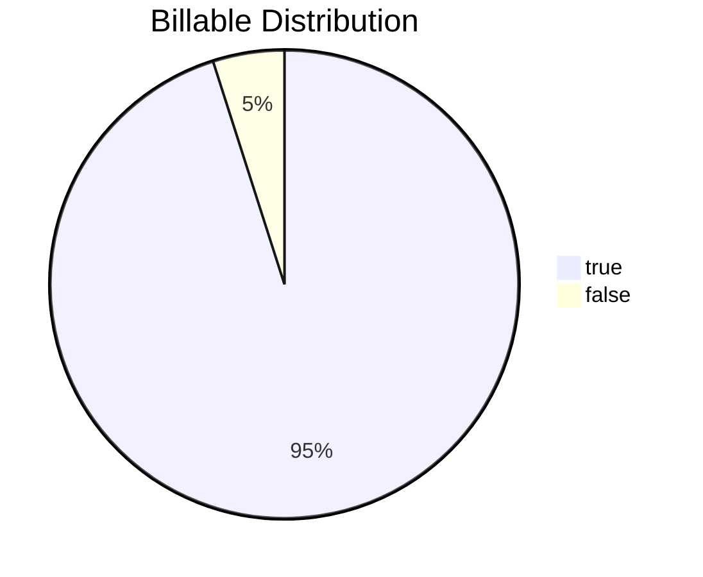

### Top Project Types (Top 10)

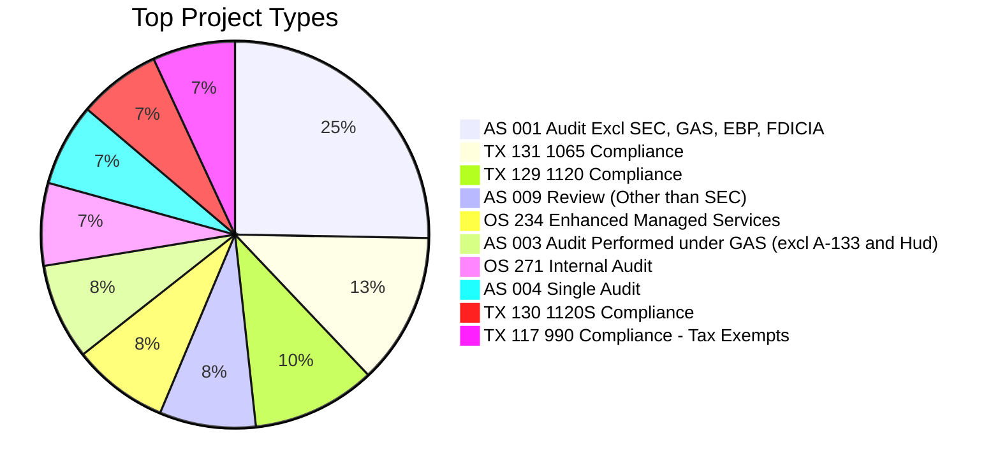

## Notes

- Values above are sourced from command output and represent the shared snapshot.
- Re-run scripts and update this file when data changes.